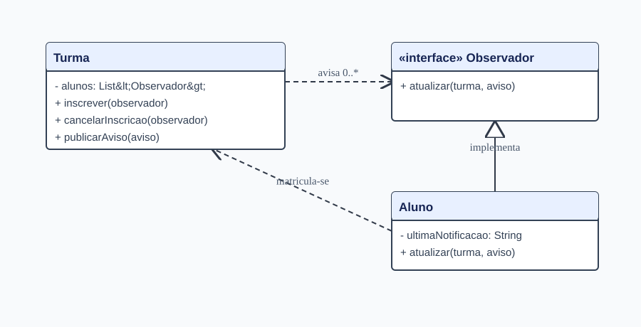

# Observer

Exercício de Arquitetura de Software. A turma publica avisos, e os alunos matriculados recebem as atualizações. Alunos de outras turmas e ex-inscritos não recebem avisos.

## Executar

`mvn test`

Inspirado no cenário de turma e alunos do [professor](https://github.com/marcoaparaujo/padroes-projeto), usando interfaces próprias em vez das classes `Observable` e `Observer` descontinuadas no Java.
